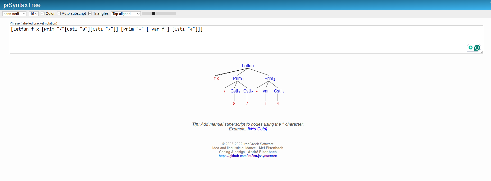
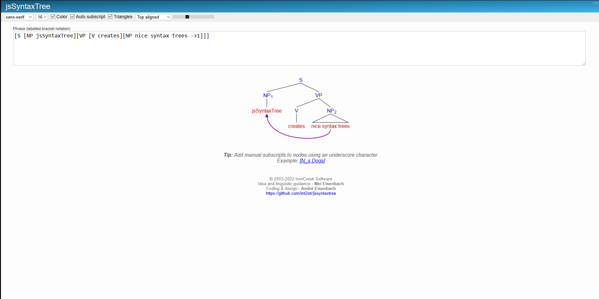

# MyAST Project

Welcome to the **MyAST Project**! This repository is part of the CS510 coursework and focuses on abstract syntax tree (AST) manipulation and analysis.

## Overview

This project can show an AST structure created from labeled bracket notation 

## Features

- **Visualization**: Visualize the AST structure using graphical representations.

## Screenshots

Below are some screenshots showcasing the functionality of the project:

### AST Examples




## How To Use

1. Clone the repository:
    ```bash
    git clone https://github.com/yourusername/MyAST.git
    ```
2. Restore using "dotnet restore" after moving your working folder to the MyAST folder.
3. Use "dotnet run" to start the webapp.


## License

This project is licensed under the MIT License. See the [LICENSE](LICENSE) file for details.
